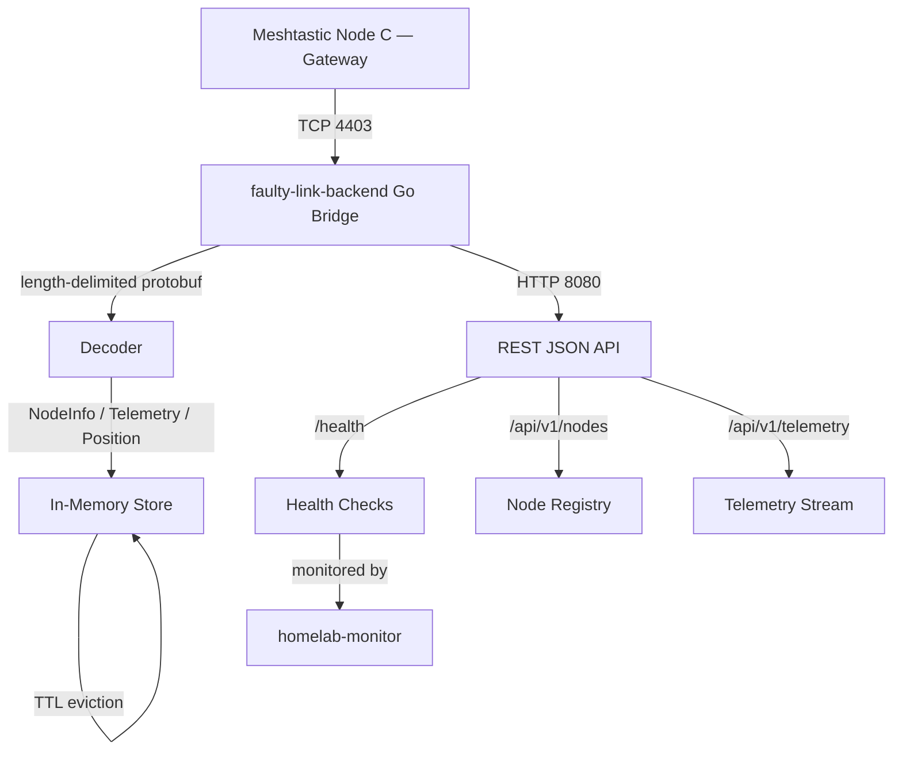

# faulty-link-backend

> Intelligent mesh-network backend — a Go HTTP bridge that connects to a **Meshtastic** mesh node via TCP, ingests protobuf telemetry, and exposes a REST JSON API. Built to bring off-grid sensor data into the modern stack.

This project is part of a portfolio narrative: **Self-healing homelab infrastructure with intelligent mesh-network backend**. It pairs with [`homelab-monitor`](https://github.com/peteedoo/homelab-monitor), a Python CLI that keeps the Docker/system stack healthy.

## Architecture

```
┌─────────────────────────────────────────────────────────────────────────────┐
│                           Meshtastic Mesh Network                            │
│  ┌──────────────┐  LoRa  ┌──────────────┐  LoRa  ┌──────────────┐          │
│  │  Node A      │◄──────►│  Node B      │◄──────►│  Node C      │          │
│  │  (sensor)    │        │  (repeater)  │        │  (gateway)   │          │
│  └──────────────┘        └──────────────┘        └──────┬───────┘          │
│                                                         │ TCP 4403          │
└─────────────────────────────────────────────────────────┼───────────────────┘
                                                          ▼
┌─────────────────────────────────────────────────────────────────────────────┐
│                              Homelab Host                                    │
│  ┌──────────────────────┐    ┌──────────────────────────────────────────┐  │
│  │  faulty-link-backend │◄───┤  Meshtastic Gateway Node (TCP 4403)      │  │
│  │  (Go bridge)         │    │  • Protobuf length-delimited stream      │  │
│  │                      │    └──────────────────────────────────────────┘  │
│  │  • TCP client        │                                                  │
│  │  • Protobuf decoder  │    ┌──────────────────────────────────────────┐  │
│  │  • In-memory store   │    │  Docker (monitored by homelab-monitor)   │  │
│  │  • REST JSON API     │    │  • Auto-restart on unhealthy             │  │
│  └──────────────────────┘    └──────────────────────────────────────────┘  │
│           │ HTTP 8080                                                        │
│           ▼                                                                  │
│  ┌──────────────────────────────────────────────────────────────────────┐   │
│  │  Consumers                                                           │   │
│  │  • Python CLI (polls API)                                            │   │
│  │  • Grafana / Prometheus (future)                                     │   │
│  │  • Web dashboard (future)                                            │   │
│  └──────────────────────────────────────────────────────────────────────┘   │
└─────────────────────────────────────────────────────────────────────────────┘
```

### Component Diagram (Mermaid)



## Features

- [x] **Meshtastic TCP client** — auto-reconnect with exponential backoff + jitter
- [x] **Length-delimited protobuf decoder** — parses `FromRadio` stream framing
- [x] **Message dispatch** — routes `NodeInfo`, `Telemetry`, and `Position` to the store
- [x] **In-memory store** — thread-safe with TTL eviction and per-node telemetry ring buffers
- [x] **REST JSON API** — `/health`, `/api/v1/nodes`, `/api/v1/telemetry`
- [x] **Python CLI** — lightweight polling client for the API
- [x] **Graceful shutdown** — `SIGINT`/`SIGTERM` handling with `context.Cancel` + `sync.WaitGroup`
- [ ] **WebSocket streaming** — push telemetry to browsers in real time
- [ ] **Docker Compose** — one-command local dev stack
- [ ] **Prometheus metrics** — export mesh node count, connection state, message rate
- [ ] **SQLite persistence** — survive restarts without losing telemetry history

## Quick Start

### Prerequisites

- Go 1.23+
- Python 3.11+ (for CLI)
- A Meshtastic node reachable on TCP port 4403 (or use a mock for dev)

### Run the Bridge

```bash
cd ~/faulty-link-backend
make run-bridge
# or: go run ./cmd/bridge
```

The bridge listens on `:8080` by default and attempts to dial the mesh node at `localhost:4403`. Override with environment variables:

```bash
MESH_ADDR=192.168.1.100:4403 HTTP_ADDR=:9090 go run ./cmd/bridge
```

### Run the CLI

```bash
cd ~/faulty-link-backend/cli
python -m venv .venv
source .venv/bin/activate
pip install -r requirements.txt

python -m faulty_link_cli.main health
python -m faulty_link_cli.main nodes
python -m faulty_link_cli.main telemetry --node-id "!abcd1234"
```

## Setup / Install

### Go binary

```bash
cd ~/faulty-link-backend
go build -o bridge ./cmd/bridge
./bridge
```

### Python CLI (editable)

```bash
cd ~/faulty-link-backend/cli
python -m venv .venv
source .venv/bin/activate
pip install -e .
```

## Usage Examples

### Health check

```bash
$ curl -s http://localhost:8080/health | jq
{
  "status": "ok",
  "connected": true,
  "node_count": 4,
  "telemetry_count": 4,
  "position_count": 2,
  "timestamp": "2025-05-26T01:30:00Z"
}
```

**Screenshot description:** A terminal showing a `curl` command piped through `jq`, with colorized JSON. The `status` field is green (`"ok"`), `connected` is `true`, and counts reflect a live mesh with four nodes.

### List mesh nodes

```bash
$ curl -s http://localhost:8080/api/v1/nodes | jq '.nodes[] | {id: .node_id, name: .long_name, hw: .hw_model}'
{
  "id": "!a1b2c3d4",
  "name": "BaseCamp-Gateway",
  "hw": "LILYGO_TBEAM"
}
{
  "id": "!e5f6g7h8",
  "name": "TrailSensor-01",
  "hw": "RAK4631"
}
```

**Screenshot description:** Terminal output from `curl` showing two mesh nodes: a LILYGO T-Beam gateway and a RAK4631 trail sensor. The JSON is pretty-printed and colorized by `jq`.

### Query telemetry

```bash
# All latest telemetry
$ curl -s http://localhost:8080/api/v1/telemetry | jq

# Filter by node
$ curl -s "http://localhost:8080/api/v1/telemetry?node_id=!a1b2c3d4" | jq '.telemetry.battery_level'
87
```

**Screenshot description:** Two terminal panes. Left pane shows a table-like JSON array of telemetry samples (battery, voltage, temperature). Right pane shows a single numeric value (`87`) returned by filtering to a specific node.

## API Endpoints

| Method | Path | Description |
|--------|------|-------------|
| GET | `/health` | Bridge + mesh connection health |
| GET | `/api/v1/nodes` | List known mesh nodes |
| GET | `/api/v1/telemetry?node_id=` | Latest telemetry (all nodes or filtered) |

## Project Structure

```
.
├── cmd/bridge/main.go          # Go service entrypoint
├── internal/mesh/
│   ├── client.go               # Meshtastic TCP client with reconnect
│   ├── decoder.go              # Length-delimited protobuf framing
│   ├── store.go                # Thread-safe in-memory store + TTL
│   ├── models.go               # NodeInfo, Telemetry, Position structs
│   ├── client_test.go          # Connection/reconnect tests
│   ├── decoder_test.go         # Framing decoder tests
│   └── store_test.go           # Store and ring buffer tests
├── api/
│   ├── handlers.go             # HTTP handlers
│   └── handlers_test.go        # Handler tests
├── cli/
│   ├── faulty_link_cli/
│   │   ├── __init__.py
│   │   └── main.py             # argparse CLI
│   └── requirements.txt
├── third_party/protobufs/      # Meshtastic protobuf definitions + generated Go
├── go.mod
├── Makefile
├── DESIGN.md                   # Deep-dive architecture doc
├── BUILD.md                    # Build instructions
└── README.md
```

## Makefile Targets

| Target | Description |
|--------|-------------|
| `make run-bridge` | Start the Go bridge service |
| `make run-cli` | Run a sample CLI command |
| `make test` | Run Go and Python tests |
| `make fmt` | Format Go code |
| `make vet` | Run `go vet` |

## Testing

### Go tests

```bash
cd ~/faulty-link-backend
go test ./...

# Verbose with race detector
go test -race -v ./...

# Specific package
go test -v ./internal/mesh
```

The Go test suite covers:
- **Decoder** (`decoder_test.go`) — varint framing, oversized message rejection, protobuf unmarshalling
- **Store** (`store_test.go`) — TTL eviction, ring buffer correctness, thread safety
- **Handlers** (`handlers_test.go`) — HTTP response codes, JSON shape, degraded state handling

### Python CLI tests

```bash
cd ~/faulty-link-backend/cli
python -m pytest -q || true
```

## Stack

- **Go 1.23** — `net/http`, `context`, `sync`, `google.golang.org/protobuf`
- **Python 3.11+** — `requests`, `argparse`
- **Meshtastic** — TCP protobuf stream on port 4403, `FromRadio` / `ToRadio` framing
- **Docker** — containerized deployment (monitored by `homelab-monitor`)

## Roadmap

| Status | Item |
|--------|------|
| ✅ | Meshtastic TCP client with auto-reconnect |
| ✅ | Length-delimited protobuf decoder |
| ✅ | In-memory store with TTL + ring buffers |
| ✅ | REST JSON API (`/health`, `/nodes`, `/telemetry`) |
| ✅ | Python polling CLI |
| 🔄 | WebSocket `/ws/telemetry` streaming endpoint |
| 🔄 | Docker Compose dev stack |
| 📋 | Prometheus metrics export |
| 📋 | SQLite persistence for telemetry history |
| 📋 | TLS/mTLS for HTTP API |

---

*Part of the [Faulty Link portfolio](https://github.com/peteedoo) — self-healing infrastructure for off-grid mesh networks.*
